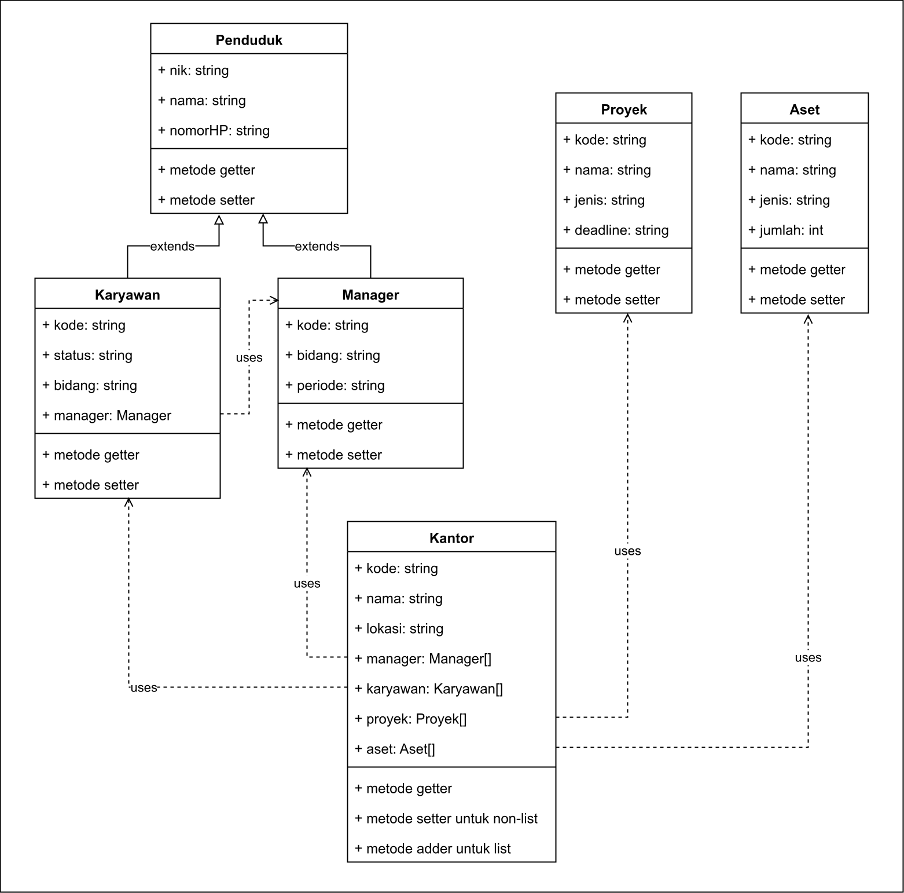

# Tugas Praktikum DPBO #3

Dibuat untuk menyelesaikan TP3 Desain Pemrograman Berorientasi Objek (DPBO)

## Janji

Saya Willsoon Tulus Parluhutan Simanjuntak dengan NIM 2404756 mengerjakan evaluasi Tugas Praktikum 3 dalam mata kuliah Desain Pemrograman Berorientasi Objek untuk keberkahanNya maka saya tidak melakukan kecurangan seperti yang telah dispesifikasikan. 

Aamiin.

## Desain diagram

Program ini diperuntukkan untuk Perkantoran IT dan memiliki 6 kelas, yaitu kelas "Penduduk", "Karyawan", "Manager", "Proyek", "Aset", dan "Kantor" sesuai dengan peta UML berikut:

## Deskripsi diagram

Setiap kelas memiliki atribut dan metode getter / setter yang sesuai dengan atributnya masing-masing. Terkecuali untuk kelas Kantor, yang dimana metode setter hanya tersedia untuk atribut yang menampung satu data saja, sedangkan untuk atribut yang menampung lebih dari satu data (List), menggunakan metode adder yang berfungsi untuk menambahkan objek baru kepada atribut tersebut.

## Deskripsi desain program

Kelas "Penduduk" merupakan suatu basis untuk kelas Karyawan dan Manager, yang dimana kelas Karyawan menggunakan kelas Manager sebagai atribut yang menentukan siapa yang mengelola pekerjaannya.

## Deskripsi alur program

Setiap program berjalan, program ini akan memasukkan data dummy minimal sebanyak 2 objek per kelas. Program ini menggunakan antarmuka CLI dan dapat melakukan hal sebagai berikut:

1. Menambahkan objek baru pada suatu objek kantor berdasarkan kode kantor.
2. Menambahkan objek kantor baru, yang hanya mengisi atribut satu-data, dan atribut multi-data masih kosong.
3. Menampilkan seluruh objek kantor dalam bentuk list.
4. Menampilkan seluruh data dalam suatu objek kantor, yang diawali dari atribut inti dalam bentuk list, serta atribut multi-objek dalam bentuk tabel.

## Preview operasional program

C++:

Python:

Java:

